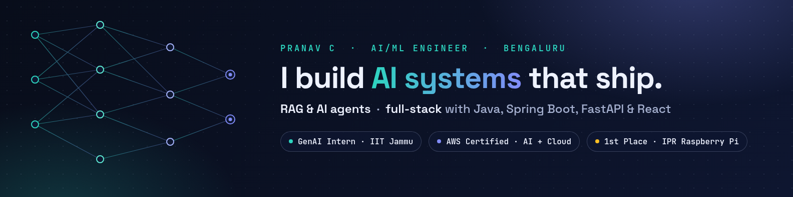

### Hi, I'm Pranav 👋

I'm a B.Tech CSE (AI & ML) student at Presidency University, Bengaluru (class of 2027).
I build AI systems end to end: RAG assistants and multi-agent apps, the APIs behind them, and the UIs people use.
I also ship real software for real clients, like a temple billing app that has been in daily production use since 2025.

- 🧠 **GenAI Intern at IIT Jammu** (Summer 2026): multi-agent RAG and n8n automation
- 🏆 **1st place, IPR** (Innovative Projects using Raspberry Pi): sign-language-to-speech on a Raspberry Pi
- ☁️ **AWS Certified** AI Practitioner and Cloud Practitioner
- 🌐 [Portfolio](https://pranavchandrashekar.vercel.app) · 📫 [LinkedIn](https://linkedin.com/in/pranavchandrashekar) · [Email](mailto:pranavchandrashekar5@gmail.com)

---

### 🚀 Featured projects

| Project | What it is | Stack |
|---|---|---|
| [**Diabetes Readmission Predictor**](https://github.com/pranav6266/diabetes-readmission-predictor) | 30-day readmission risk from 100k hospital records; ONNX model served from Java | PySpark, scikit-learn, ONNX, Spring Boot, React |
| [**Personal Expense Tracker**](https://github.com/pranav6266/personal-expense-tracker) | Full-stack app with web and desktop clients, one-command Docker setup | Spring Boot, PostgreSQL, React, JavaFX, Docker |
| [**Multi-Agent RAG Assistant**](https://github.com/pranav6266/AI-Agents-Final-Capstone) | 8 specialist agents with human-in-the-loop approval (IIT Jammu capstone) | OpenAI Agents SDK, ChromaDB, Streamlit |
| [**Temple Billing Software**](https://github.com/pranav6266/temple-software) | Offline billing and receipt printing, in production at a temple | Java, JavaFX, H2, ESC/POS |
| [**n8n Expense Automation**](https://github.com/pranav6266/N8N-Expense-Management-System) | 4-stage workflow that reads receipts with a vision model | n8n, Ollama |
| [**MedExpress**](https://github.com/pranav6266/Med-Express) | Medicine delivery platform with user, agent and admin roles | MongoDB, Express, React, Node.js |
| [**Offline Voice Assistant**](https://github.com/pranav6266/omarchy-agent) | Hotkey voice sessions on Linux: speech-to-text, a typed-decision router and local LLMs | faster-whisper, Ollama, Piper |
| [**Hand Sign to Speech**](https://github.com/pranav6266/Realtime-Handsign-to-Audio-Converter) | Real-time ASL recognition with spoken output | MediaPipe, scikit-learn, OpenCV |

### 🤝 Hackathon team projects

Built as a team with [@VelvetGradient-26](https://github.com/VelvetGradient-26).

| Project | Event | Stack |
|---|---|---|
| [**MarisAI**](https://github.com/VelvetGradient-26/MarisAI) | SIH internal round: marine intelligence platform with a 3D globe and an AI ocean assistant, deployed on AWS EC2 | FastAPI, PostGIS, React, MapLibre |
| [**NariConnect AI**](https://github.com/VelvetGradient-26/NariConnect) | SheLeads 2.0: RAG that matches women to 3,500+ government schemes | FastAPI, Qdrant, MongoDB, React |
| [**PharmaGuard**](https://github.com/VelvetGradient-26/PharmaGuard) · [live](https://pharmaguard-frontend-nine.vercel.app) | RIFT'26: pharmacogenomic risk prediction with explainable AI | FastAPI, Gemini, React |
| [**FinGuard AI**](https://github.com/VelvetGradient-26/BWT_CodeCorps) · [live](https://bwt-code-corps.vercel.app) | BWT Hackathon: financial safety assistant with OCR and explainable AI | FastAPI, MongoDB, React |

### 🏅 Awards

- 🥇 **1st place**, Innovative Projects using Raspberry Pi (IPR), out of 506 teams (2024)
- 🥈 **2nd place**, Datathon at Innovatex 4.0, Presidency University
- Participant: Smart India Hackathon (internal round), RIFT'26, SheLeads 2.0, BWT Hackathon

### 🛠️ Tech I use

- **AI/ML:** RAG · AI agents · LangChain · OpenAI Agents SDK · Qdrant · ChromaDB · Hugging Face · scikit-learn · PySpark · ONNX
- **Backend:** Java · Spring Boot · FastAPI · Node.js · Express · MongoDB · PostgreSQL · MySQL
- **Frontend:** React · TypeScript · Next.js · Tailwind CSS · JavaFX
- **Cloud & tools:** AWS · Docker · n8n · Git · Linux (Arch + Hyprland)

### 📜 Certifications

AWS Certified AI Practitioner · AWS Certified Cloud Practitioner · IIT Kanpur MERN Full Stack · LangChain Foundations · n8n (Quickstart, 101, 102, 103) · Anthropic (Claude Code in Action, AI Fluency, Agent Skills, Subagents) · Hugging Face (LLM Course, AI Agents)
